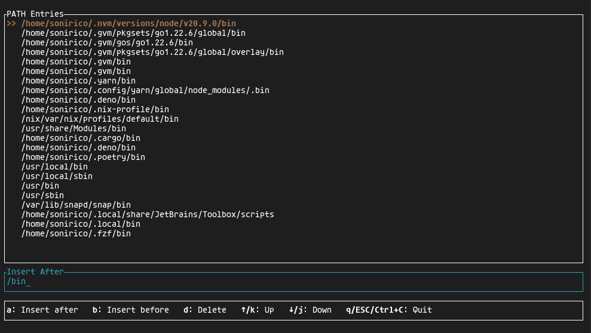

# Pathctl

Command-line tool designed to help you manage your `PATH` environment variable with ease. It 
provides an interactive text-based user interface to view, add, and remove entries from your `PATH`.



**Note:** This tool has been tested only on Linux environments. Compatibility with macOS or Windows is not yet guaranteed.

## Installation

```bash
git clone https://github.com/sonirico/pathctl.git
cd pathctl
cargo build --release
install -m 555 ./target/release/pathctl /usr/local/bin/pathctl
```

## Limitations

- Tested exclusively on Linux environments. Compatibility with macOS and Windows has not been verified.
- Process isolation makes too hacky altering parent process `PATH` env var. To actually change your current
  shell session `PATH` variable, execute the `export` command after program termination.

## Contributing

Contributions are welcome. Please submit a pull request or open an issue to discuss potential changes.

## License

This project is licensed under the [MIT](./LICENSE) License.
